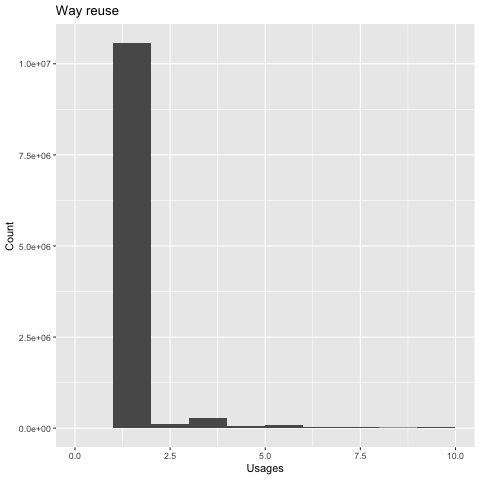

## OpenStreetMap Jigsaw

An area based approach to geocoding with OpenStreetMap extracts.
This system attempts to extract every area from an OpenStreetMap extract and sort them into a graph.

This graph is then exported as a [set of Protocol buffer files](#output-files) which can be exposed as a [JSON API](osm-jigsaw-api).

This hierarchy can be used to infer a place name from the areas enclosing a given point.

An full [planet example is viewable here](https://osm-jigsaw.eelpieconsulting.co.uk).

### Background

Gecoding is the art turning a location point into a human readable name (and vice versa).
(ie. 51.0, -0.3 <--> London, United Kingdom).

[Nominatim](https://wiki.openstreetmap.org/wiki/Nominatim) is the default OpenStreetMap geocoding solution.
It does are really great job of inferring structure and using it to construct sensible place names.

Nominatim uses a Postgres database populated with the entire OpenStreetMap dataset.
This can be operationally challenging for a number of reasons including:

- A full import requires alot of storage (~1TB of SSD disk)
- An initial import of the full dataset can take a long time (days).
- The long lead time means that the database tends to become a permanent fixture rather than a disposable cloud citizen.
- Important parts of the Nominatim code are implemented as a Postgres module making it more difficult to alter.
- Cloud deployments are prohibitively expensive.

Is it possible to approach this problem from a more stateless angle?
Can we transform a raw OSM data extract into a structured graph in application code without having to import a database?

### Considerations

The OpenStreetMap data model is a fairly unstructured, flat format. The implied structure comes from a loosely applied hierarchy of tags.
The full dataset contains around 5 billion entities is in the region of 40Gb compressed.

These considerations come to mind:

- Minimise preprocessing by using the existing OSM extract format as input (likely the compressed .pbf format)

- Try not to use local knowledge. 
ie. The system should infer that England and Wales are inside the United Kingdom and that Yosemite National Park is in California from the shape of the data rather than hardcoded rules or
human intervention.

- Try to defer decision making. Avoid discarding information or baking decisions into the structure too early. Try to produce a structure which allows for the rendering to vary at runtime.

    ie. There could be multiple valid representions of where an areas sits.
    London -> United Kingdom
    London -> Greater London -> England -> United Kingdom.

    Even if the former is the desired output, the graph should represent all of the possible paths so that the consumer is free to change it's mind at runtime.

- We're happy to live without partial updates so long as a full update can be performed in a reasonable timeframe (hours not days).

- It should be possible to process a full planet file on a reasonably well equipped developer machine (say 32Gb of RAM).

### Proposed approach

Starting with a raw OSM extract file, preform a number of independent transformations until we have a sorted collection of areas.

#### 1) Extract interesting entities

To get the dataset down to manageable size, extract any OSM entities which might represent areas into a working file.

Take all of the relations and the ways which are marked as closed.
Discard any entities which do not have name tags.
Collect the sub relations, ways and nodes which make up these entities.

Some relations have sub relations which form circular references; we should ignore these.

This step takes the ~40Gb planet extract down to ~8Gb.

#### 2) Resolve relations and closed ways into areas

Attempt to build closed shapes from the filtered entities.

Relations may be composed of multiple ways and sub relations which will need to be resolved.
A single relation could represent multiple areas (ie. a group of islands).

Ways within a relation might not always be in sequential order. 
Ways within an relation outline may be pointing in different directions. A certain amount of trail and error might be needed.

Output the resolved areas in an unsorted file.

#### 3) Sort the areas into a hierarchy

Much like a gravel sorting sieve. Smaller areas should fall down into larger areas. More important relations like countries should float to the top.
The resulting structure will look vaguely like a heap with each child node representing an area which fits inside it's parent.

ie.
England should be a child of United Kingdom after sorting.
Bournemouth should be a descendant of England.

Output the graph in a format which can be sensibly parsed by a consumer.

### OSM Jigsaw parser

The [OSM Jigsaw parser](osm-jigsaw-parser) takes an OSM protocol buffer extract, preforms the steps described above and outputs the files described below.

### Output files

The 3 output files are in protocol buffer format and contain [OutputArea](osm-jigsaw-parser/src/main/protobuf/outputarea.proto), [OutputGraphNode](osm-jigsaw-parser/src/main/protobuf/outputgraphnode.proto) and [OutputTagging](osm-jigsaw-parser/src/main/protobuf/outputtagging.proto) objects.
These formats are described below.
These 3 files should be placed in a location where they are accessible to the [OSM Jigsaw API](osm-jigsaw-api).

Protocol buffer was chosen for it's relatively small file size and fast import; it's also consistent with the OSM extract files.

A collection of [prebuilt files](https://s3-eu-west-1.amazonaws.com/osm-jigsaw) is available.

#### OutputArea

Describes and areas extracted from an OSM relation or way.

| Field | Type | Description|
| ------------- | ------------- | ------------- |
| id  |  Long  | A disposable id which can be used to reference this area when assembling the graph. This id is not likely to remain the same for a particular area over time.|
| osm_ids     | List of String | A list of the OSM ids for entities which match this area. ie. 123W, 456W|
| latitudes   | List of Double | A list of the latitudes of the points which form the outline for this area.|
| longitudes  | List of Double  | A list of the longitudes of the points which form the outline for this area.|
| area | Double | The size of the area.|

#### OutputGraphNode

Describes a node on the graph of sorted areas.

| Field | Type | Description|
| ------------- | ------------- | ------------- |
| area  |  Long  | The id of the area which occupies this node.|
| parent  |  Long  | The (optional) id of the graph node which is the parent of this node.|

The graph protocol buffer file is written in the order of a depth first traversal.

#### OutputTagging

Represents the OSM tags for an OSM id.

| Field | Type | Description|
| ------------- | ------------- | ------------- |
| osm_ids     | String | The OSM ids these tags apply to. ie. 123R |
| keys     | List of String | The tag keys. ie. name:en |
| osm_ids     | List of String | The tag values. ie. England |

Why aren't the areas and tags inlined into the graph file?
Keeping the areas and tags separate from the graph allows for deduplication of the areas which appear in overlaps.
This provides a memory saving when reloading the graph.

### Execution

A full extract runs to completion on a machine with 32Gb of RAM (no swap) in approximately 5 hours, producing 9 million areas and a graph containing 19 million nodes.

The graph can be loaded into a JVM with 30Gb of heap.
This includes all of the point data for every area and every OSM tag for the area entities.

The [API](osm-jigsaw-api) can resolve a reverse query in around 30ms.

### Way reuse

In theory, ajoining areas might share boundaries; would deduplicating share boundary ways save much?

For the full planet (20180806) 11,251,035 unique ways used.  Of which 688,828 (~6%) are used more than once.

With a distribution like:

10562207   112276   285277    48126    93281    25147    38977    15248    19230     9919    10621     7911     5031     2283     2074     1846     2517     2349     1967     1063     1140      612      621      348      341      123       85      174      145       61       17        3        1

### Deriving a location name from the area hierarchy

Given a point it is a fairly fast operation (vaguely like descending a b-tree) to step down the hierarchy of nested areas,
extracting all of the possible paths down to the smallest area enclosing the point of interest.

We can infer a human readable name from this collection of paths.

The feels like a problem which could be suited to a supervised machine learning approach, but we can get close with a rules based approach.

- As each area in the graph was derived from an OSM entity (a relation of a closed way), we can inspect the OSM tags for each area.
This should give a label for each step on the path.

- There will be classes of entity in the path which are not relevant such as time zones, electoral boundaries and historical data; these can be ignored.

- Useful components of the name may come from more than one of the paths.

- We can ignore overlapping entities with the same name as these probably aren't adding value.
 ie. New Zealand, Wellington, Wellington

- Rules can probably be applied to drop portions of some paths.
ie. Drop anything element between a country areas and a capital city.
United Kingdom, England, London -> United Kingdom, London.

- Transform the into a localised output
In english this means collecting the name:en tags and joining the smallest to largest.
ie. Bournemouth, England, United Kingdom.

A [naive implementation is provided](osm-jigsaw-api/app/naming/NaiveNamingService.scala) in the API.

### Results

This approach to geocoding does well for some use cases and less so for others.
This is a reflection of the importance of node points such as cities and neighborhoods in the OpenStreetMap data; an area based approach neglects these important points.

| Location | Outcome |
| ------------- | ------------- |
| Richmond Park | Nicely illustrates that Richmond Park is a large area which falls across multiple London boroughs. |
| Twickenham Rowing Club | Correctly places the rowing club on the Eel Pie Island matching it's colloquial address. |
| Yosemite National Park | Correctly placed in California. |
| Perth, Australia | The lack of an enclosing city area means that Perth is not mentioned in results. | 
| Bournemouth Pier | An interesting outlier. The pier sits just outside of the local authority and county boundaries, losing locality. |
